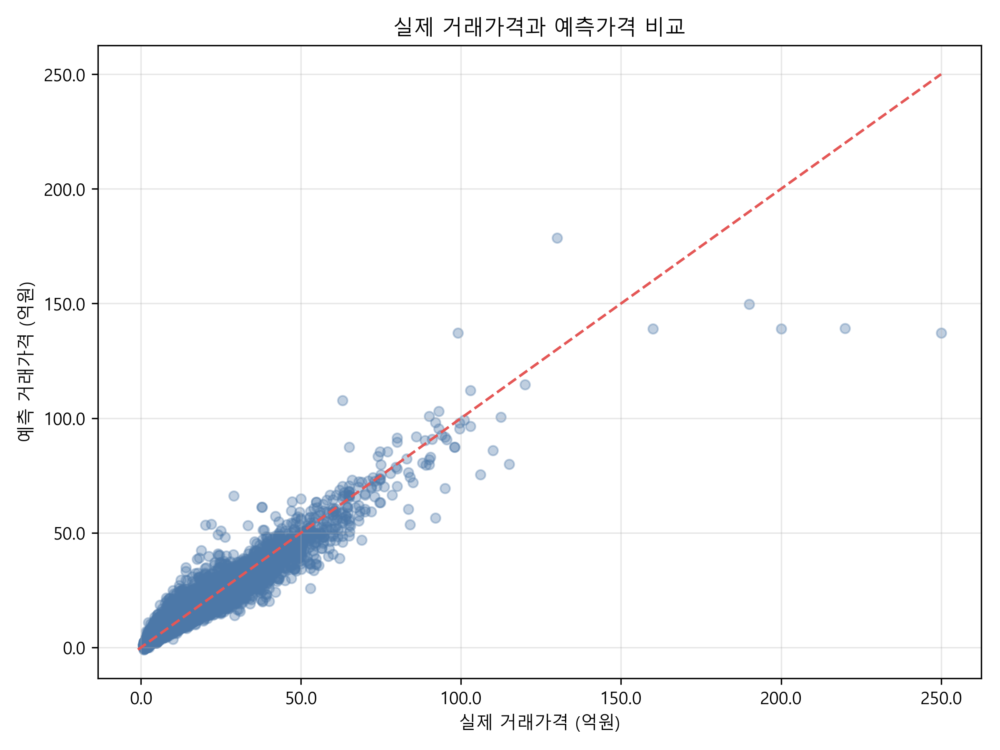
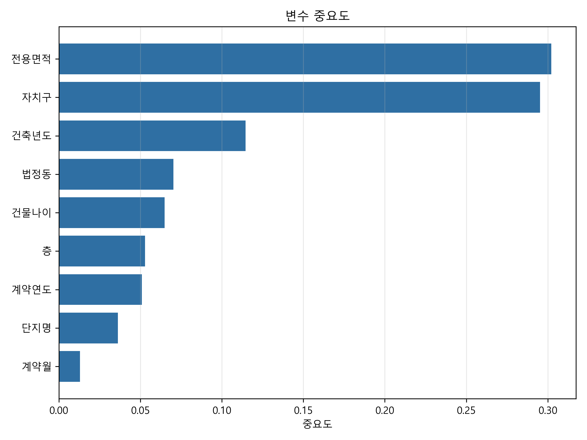

# XGBoost 기반 서울시 부동산 가격 예측 및 이상 거래 탐지

서울시 아파트 실거래가를 이용해 적정 거래가격을 예측하고, 실제가격과 예측가격의 잔차가 큰 거래를 추가 검토 후보로 선별한 프로젝트입니다. 제59회 한국정보통신학회 춘계종합학술대회에서 2026년 5월 22일 구두 발표했습니다.

> 이 프로젝트의 “이상 거래 후보”는 가격 패턴에서 크게 벗어난 관측치를 뜻합니다. 불법·부정 거래를 확정하거나 특정 거래 당사자를 평가하는 결과가 아닙니다.



## 연구 질문

면적·지역·층수·건축년도·거래 시점 등 복합적인 가격 요인을 반영해 서울시 아파트의 적정 거래가격을 예측하고, 예측값과 실제값의 차이로 추가 검토가 필요한 거래를 선별할 수 있는가?

## 데이터와 방법

- 데이터: 국토교통부 서울시 아파트 실거래가 2022–2025년
- 전처리 후 거래 수: 189,864건
- 입력 변수: 전용면적, 층, 건축년도, 건물나이, 계약연도, 계약월, 자치구, 법정동, 단지명
- 모델: `XGBRegressor`
- 분할: Train 80% / Test 20%, `random_state=42`
- 검증: Shuffle 5-Fold Cross Validation
- 후보 선정: 절대잔차 기준 상위 922건

### XGBoost 설정

| Parameter | Value |
|---|---:|
| `n_estimators` | 300 |
| `learning_rate` | 0.05 |
| `max_depth` | 6 |
| `subsample` | 0.8 |
| `colsample_bytree` | 0.8 |

## 저장된 기준 결과

현재 보관된 결과 파일의 지표는 다음과 같습니다.

| Metric | Value |
|---|---:|
| Test R² | 0.9258 |
| Test MAE | 14,742.59만원 |
| Test RMSE | 24,945.73만원 |
| 5-Fold CV mean R² | 0.9301 |

학회 발표자료에는 당시 실행 결과인 5-Fold 평균 R² `0.9172`가 기록돼 있습니다. 저장소의 기준 CSV는 이후 실행 결과이므로 수치가 다릅니다. 데이터 파일 버전과 실행 환경을 함께 고정하는 것이 후속 재현 과제입니다.



전용면적과 자치구가 가장 높은 중요도를 보였고, 건축년도·법정동·건물나이가 뒤를 이었습니다.

## 프로젝트 구조

```text
.
├── data/
│   ├── README.md
│   └── raw/                       # 직접 내려받은 CSV 배치, Git 제외
├── docs/
│   └── presentation.pptx
├── notebooks/
│   └── xgboost_baseline.ipynb
├── results/
│   ├── figures/
│   └── reference/
├── src/
│   └── train_xgboost.py
├── requirements.txt
└── README.md
```

## 실행 방법

Python 3.10 이상을 권장합니다.

```bash
python -m venv .venv
source .venv/bin/activate
pip install -r requirements.txt
```

[데이터 안내](data/README.md)에 따라 CSV를 `data/raw/`에 배치한 뒤 실행합니다.

```bash
python src/train_xgboost.py \
  --data-dir data/raw \
  --output-dir results/generated \
  --top-n 922
```

생성되는 거래별 예측 결과와 이상 거래 후보 목록은 `results/generated/`에 저장되며 Git에는 포함되지 않습니다.

## 한계와 후속 연구

- 교통 접근성, 학군, 금리, 개발 호재, 리모델링 여부 등 외부 변수를 포함하지 않았습니다.
- Label Encoding은 범주 사이에 임의의 순서 관계를 부여할 수 있습니다.
- 절대잔차가 큰 거래를 선별하는 휴리스틱이므로 이상 원인을 직접 설명하지 못합니다.
- 현재 전체 데이터의 후보 점수는 단일 학습 모델의 예측을 사용합니다. 후속 연구에서는 Out-of-Fold 예측을 이용해 후보 점수의 낙관 편향을 줄일 필요가 있습니다.
- 자치구별 모델, 시간 순서 기반 검증, 외부 변수 통합과 이상 유형별 평가가 필요합니다.

## 발표자료

- [학회 발표 슬라이드](docs/presentation.pptx)

## 출처

- [국토교통부 실거래가 공개시스템](https://rt.molit.go.kr/)
- [scikit-learn documentation](https://scikit-learn.org/)
- [XGBoost documentation](https://xgboost.readthedocs.io/)
